<picture>
  <source media="(prefers-color-scheme: dark)" srcset="./assets/sheet-01-dark.svg">
  <source media="(prefers-color-scheme: light)" srcset="./assets/sheet-01-light.svg">
  
</picture>

<a href="https://nsource.ch/en/ergane.html"><picture><source media="(prefers-color-scheme: dark)" srcset="./assets/tag-ergane-dark.svg"><source media="(prefers-color-scheme: light)" srcset="./assets/tag-ergane-light.svg"></picture></a>
<a href="https://nsource.ch/en/"><picture><source media="(prefers-color-scheme: dark)" srcset="./assets/tag-netsource-dark.svg"><source media="(prefers-color-scheme: light)" srcset="./assets/tag-netsource-light.svg"></picture></a>
<a href="https://discord.gg/eAW8AGXaGu"><picture><source media="(prefers-color-scheme: dark)" srcset="./assets/tag-discord-dark.svg"><source media="(prefers-color-scheme: light)" srcset="./assets/tag-discord-light.svg"></picture></a>
<a href="https://gitlab.com/schufi73"><picture><source media="(prefers-color-scheme: dark)" srcset="./assets/tag-gitlab-dark.svg"><source media="(prefers-color-scheme: light)" srcset="./assets/tag-gitlab-light.svg"></picture></a>

I'm Noah, partner for development and AI at [NetSource](https://nsource.ch/en/), which has looked after small businesses in Ticino since 1998. First computer at age 11. Today I write programs that handle the boring work — and run in the client's office.

Minecraft and taking things apart taught me to code. Networks and security came next, then an apprenticeship as a civil engineering draughtsman, which is why this profile is a drawing sheet.

### On the board · September 2026

**ERGANE** · [nsource.ch/en/ergane](https://nsource.ch/en/ergane.html) Shop-floor software for CNC machine shops. It runs on the workshop's own server and reads 1990s controls and new machines side by side on one screen, with no hardware to fit. It sends NC programs and reads them back byte for byte. It never moves an axis.

**Stage LED wall** · Japan Matsuri Bellinzona I'm a member of the association and part of the crew. At NetSource we build the software that runs the stage LED wall.

**VoidBorn** · JarCloud An action-RPG for Minecraft servers, written in Java on Paper 1.21.1: about 60k lines, 1,300+ tests, and bots that play-test it on a real server. JarCloud is my Minecraft studio and community. Come and say hi in the [JarCloud Community on Discord](https://discord.gg/eAW8AGXaGu).

<picture>
  <source media="(prefers-color-scheme: dark)" srcset="./assets/sheet-02-dark.svg">
  <source media="(prefers-color-scheme: light)" srcset="./assets/sheet-02-light.svg">
  
</picture>

GitHub shows few contributions because almost everything I write lives in private repositories, many of them on GitLab: 5,500+ commits in the last 12 months (Sep 2026).

Scrivimi pure in italiano; Deutsch geht auch.
